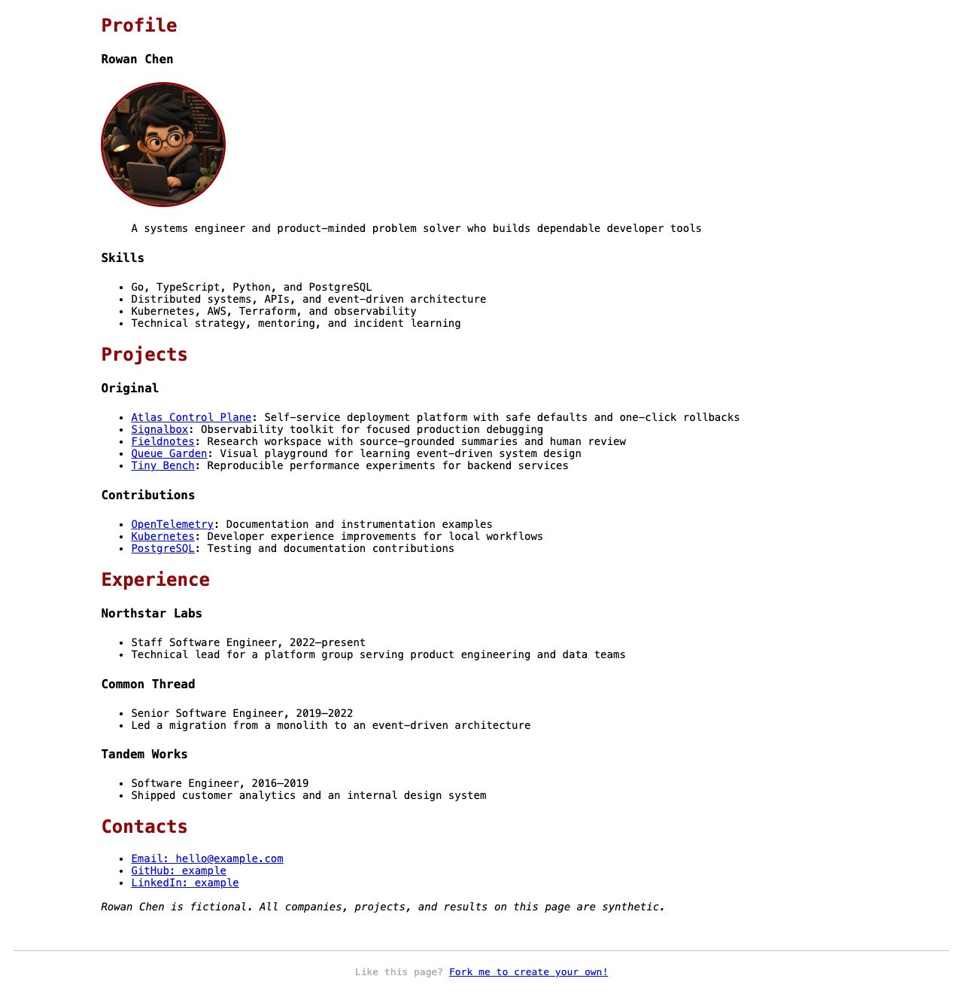

# Geek Profile
Write your profile in Markdown and publish it on GitHub Page.

## Sample

[](https://hackjutsu.com/geek-profile/)

[View the live demo](https://hackjutsu.com/geek-profile/)

## Bootstrap
Make sure you have the current Node.js LTS release and npm installed.
```bash
npm install
```

## Customize your Profile
- Customize your profile/CV/resume at `profile/src/index.md`.
- Put your customized CSS in `profile/src/css/site.css`.

## Develop
```bash
npm run dev
```
Local preview runs with Eleventy and watches Markdown/CSS changes.

## Build
```bash
npm run build
```
Static website will be generated at `./docs`.

## Release
```bash
npm run release
```
Static website will be generated in `./docs`.
Push this project to your GitHub repo's master branch and set `master branch /docs folder` as the GitHub Page source.


# License
[MIT @CosmoX](./LICENSE)
